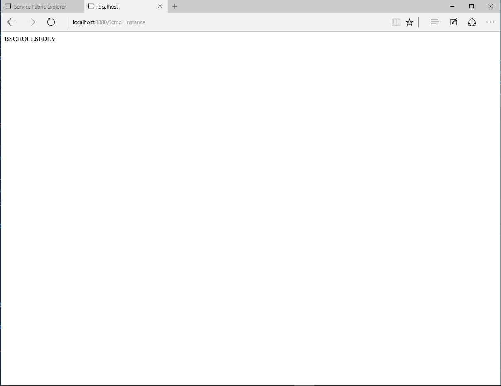
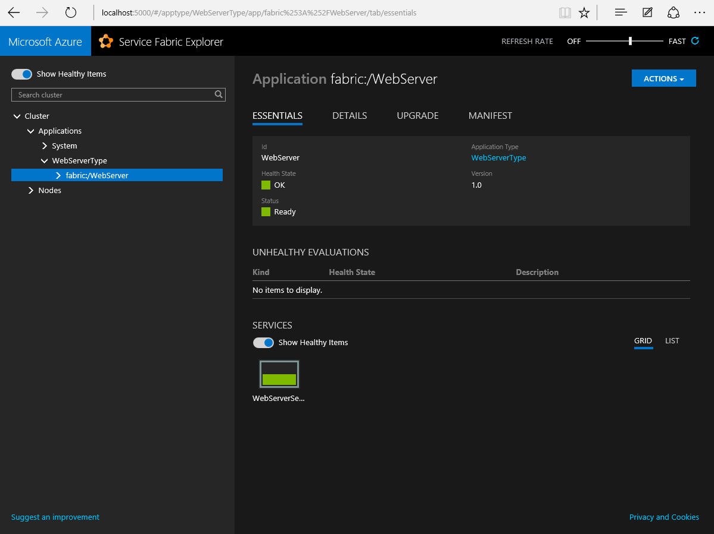

# Package and deploy an existing application

This sample application consists of a single executable, SimpleWebServer.exe, which listens to port 8080 and returns the machine name based on a query string parameter. You can launch the application by double clicking on SimpleWebServer.exe (you may need to start with elevated privileges). Type http://localhost:8080/?cmd=instance in the address bar of your browser. The image below shows the running application SimpleWebServer.exe



## Content of the sample

- SimpleWebServer.exe: The sample application
- Sources: Contains the sources of SimpleWebServer.exe
- Service Fabric Package: This folder contains a Service Fabric application package for the SimpleWebServer.exe. You can use this package in case you don't want to package the application and just play with the sample.
- Scripts: Contains a PowerShell script to deploy the Service Fabric application package to the local and remote Service Fabric cluster

## How to use the sample

### Just run it
Pull down the sample on your local machine and go to the scripts folder. Execute the PowerShell script for either your local development cluster (make sure it is running) or a Service Fabric cluster in Azure. You can check the status of the application running in Service Fabric by using the Service Fabric Explorer as shown below.




### Package the application and run it
The easiest way to create an application package is using the Service Fabric packaging tool that ships as part of the Service Fabric SDK.
The default installation location is C:\Program Files\Microsoft SDKs\Service Fabric\Tools. Browse to the tools folder using command line or PowerShell and execute the following command:

```
ServiceFabricAppPackageUtil.exe /source:[directory of SimpleWebServer.exe] /target:[directory that will contain the package] /appname:WebServer /exe:SimpleWebServer.exe
```
Modify the PowerShell script to point to your new Service Fabric application package folder and deploy it

## Learn more

To learn more about Service Fabric, check out the [platform documentation](http://aka.ms/servicefabricdocs) on azure.com.
