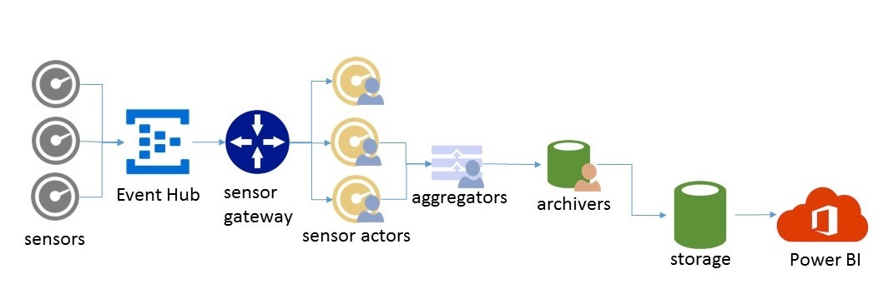

#Architecture Overview#

This IoT solution is based on the the scenario where a building has a device sensor in each room and data is sent to the cloud for monitoring and analysis.  Specifically the device sends information regarding whether the lights are on or off, current temperature,  current humidity, etc.  

The above image shows an overview of the architecture for this IoT Solution.  Even though the code is specifically written to a scenario with devices monitoring a building, it is easy to see how this solution can be adapted to other IoT scenarios.  Sensors send data to EventHub.  That data is sent to the [management gateway](./GatewayOverview.md).  The management gateway forwards the data to a sensor actor responsible for that specific device.  The [sensor actors](./SensorActorsOverview.md) forward the information to an floor actor which aggregates the data for basic management scenarios.  It also forwards the data to the [archiver actor](./DataArchiveActorsOverview.md) actor for storage and enable querying of longterm data.  PowerBI is used to query the data for insights.

This architecture shows a basic end to end story for devices to cloud.  This architecture can easily be modified to include more complicated scenario including a web management portal, commands to the devices or mobile app that shows current data.

*QUESTION: Are the sensor actors forwarding information to just aggregators or to the aggregators and the archivers?*